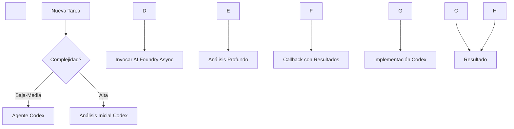

\# 🤖 Integración Asíncrona: Codex + AI Foundry


\## 📋 Arquitectura Híbrida de Agentes


El proyecto utiliza una arquitectura híbrida que combina:

\- \*\*Agentes Codex\*\*: Para tareas rutinarias y desarrollo diario (80%)

\- \*\*AI Foundry (Azure OpenAI)\*\*: Para análisis complejo y refactorización (20%)


\## 🔄 Flujo de Trabajo Asíncrono





\## 🚀 Ejemplos de Uso


\### 1. Análisis Asíncrono de Componente Complejo


```javascript

// Comando para Mobile\_App\_Agent

@codex analyze-component --file HomeScreen.tsx --async


// Flujo interno:

// 1. Mobile\_App\_Agent hace scan inicial (síncrono)

// 2. Si complejidad > 15, invoca ReadTsxAgent (asíncrono)

// 3. ReadTsxAgent analiza en background usando GPT-4o

// 4. Callback notifica cuando está listo

// 5. Mobile\_App\_Agent presenta resultados

```


\*\*Respuesta esperada:\*\*

```json

{

&nbsp; "taskId": "analysis-12345",

&nbsp; "status": "processing",

&nbsp; "estimatedTime": "2-3 minutes",

&nbsp; "callbackUrl": "http://localhost:5000/webhook/callback/analysis-12345"

}

```


\### 2. Optimización de Performance con Múltiples Agentes


```bash

\# Trigger manual

@codex optimize-performance --module mobile-app --async --priority high

```


\### 3. Generación de Tests en Batch


```javascript

// Para generar tests de múltiples componentes

@codex generate-tests --pattern "src/screens/\*\*/\*.tsx" --async --batch

```


\## 🔧 Configuración de AI Foundry


\### Deployment Activo: ReadTsxAgent

\- \*\*Modelo\*\*: GPT-4o (2024-05-13)

\- \*\*Endpoint\*\*: `https://boatrentalfoundry-dev.openai.azure.com/openai/deployments/ReadTsxAgent/chat/completions`

\- \*\*Rate Limits\*\*: 10 RPM, 10,000 tokens/min

\- \*\*Capacidades\*\*: 128K contexto, 4K output


\### Agentes Especializados Disponibles

| Agente | Modelo | Use Case | Integration |

|--------|--------|----------|-------------|

| ReadTsxAgent | GPT-4o | Análisis TSX complejo | Mobile\_App\_Agent |

| RefactorAgent | GPT-4 | Refactorización | Mobile\_App\_Agent, Backend\_Agent |

| PerformanceOptimizer | GPT-3.5 | Optimización | Mobile\_App\_Agent, Backend\_Agent |

| TestingExpert | GPT-3.5 | Generación tests | Todos los agentes |

| ArchitectureAnalyzer | GPT-4 | Análisis arquitectura | Architect\_BoatRental |


\## 📊 Triggers Automáticos


Los agentes AI Foundry se invocan automáticamente cuando:


1\. \*\*Complejidad Ciclomática > 15\*\*

&nbsp;  - Trigger: RefactorAgent

&nbsp;  - Notifica: Agente responsable del módulo


2\. \*\*Archivo > 500 líneas\*\*

&nbsp;  - Trigger: ReadTsxAgent (para TSX) o RefactorAgent (otros)

&nbsp;  - Notifica: Mobile\_App\_Agent o Backend\_Agent


3\. \*\*Cobertura de Tests < 70%\*\*

&nbsp;  - Trigger: TestingExpert

&nbsp;  - Notifica: Todos los agentes relevantes


4\. \*\*Performance Regression Detectada\*\*

&nbsp;  - Trigger: PerformanceOptimizer

&nbsp;  - Notifica: Mobile\_App\_Agent + Backend\_Agent


\## 🛠️ Comandos de Invocación


```bash

\# Análisis de componente TSX

@codex invoke-foundry --agent ReadTsxAgent --file mobile-app/src/screens/home/HomeScreen.tsx


\# Refactorización compleja

@codex invoke-foundry --agent RefactorAgent --complexity high --module mobile-app


\# Análisis de arquitectura

@codex invoke-foundry --agent ArchitectureAnalyzer --scope full-project


\# Verificar estado de tareas asíncronas

@codex status --async

```


\## 📈 Monitoreo de Tareas Asíncronas


```bash

\# Ver todas las tareas en progreso

@codex status --async


\# Output:

┌─────────────┬──────────────────┬──────────┬─────────┬───────────┐

│ Task ID     │ Type             │ Agent    │ Status  │ Progress  │

├─────────────┼──────────────────┼──────────┼─────────┼───────────┤

│ tsx-98765   │ Component Analysis│ ReadTsx  │ Running │ 45%       │

│ perf-54321  │ Performance      │ PerfOpt  │ Queued  │ 0%        │

│ test-11111  │ Test Generation  │ TestExp  │ Running │ 78%       │

└─────────────┴──────────────────┴──────────┴─────────┴───────────┘

```


\### Métricas en Tiempo Real


```javascript

// Webhook notification

POST /webhook/callback

{

&nbsp; "taskId": "tsx-98765",

&nbsp; "status": "completed",

&nbsp; "agent": "ReadTsxAgent",

&nbsp; "results": {

&nbsp;   "complexity": 18,

&nbsp;   "lines": 523,

&nbsp;   "dependencies": 12,

&nbsp;   "suggestions": \[

&nbsp;     "Split into 3 smaller components",

&nbsp;     "Extract custom hooks",

&nbsp;     "Optimize re-renders"

&nbsp;   ]

&nbsp; },

&nbsp; "metrics": {

&nbsp;   "executionTime": 45000,

&nbsp;   "tokensUsed": 3500,

&nbsp;   "cost": 0.14

&nbsp; }

}

```


\## 🔄 Patrones de Integración


\### Pattern 1: Fire and Forget

```javascript

// Para tareas no críticas

async function analyzeInBackground(file) {

&nbsp; const taskId = await codex.analyzeAsync(file, {

&nbsp;   priority: 'low',

&nbsp;   callback: false

&nbsp; });

&nbsp; 

&nbsp; console.log(`Analysis started: ${taskId}`);

&nbsp; // No esperar resultado

}

```


\### Pattern 2: Async/Await con Polling

```javascript

// Para tareas críticas

async function refactorWithAI(component) {

&nbsp; const taskId = await codex.refactorAsync(component, {

&nbsp;   priority: 'high',

&nbsp;   agent: 'RefactorAgent'

&nbsp; });

&nbsp; 

&nbsp; // Polling cada 5 segundos

&nbsp; const result = await codex.waitForCompletion(taskId, {

&nbsp;   pollInterval: 5000,

&nbsp;   timeout: 300000

&nbsp; });

&nbsp; 

&nbsp; return result;

}

```


\### Pattern 3: Event-Driven con Callbacks

```javascript

// Para flujos complejos

async function complexWorkflow(module) {

&nbsp; const workflow = await codex.startWorkflow('performance\_optimization', {

&nbsp;   module,

&nbsp;   callbacks: {

&nbsp;     onStepComplete: (step) => console.log(`Step ${step.id} completed`),

&nbsp;     onError: (error) => handleError(error),

&nbsp;     onComplete: (results) => applyOptimizations(results)

&nbsp;   }

&nbsp; });

&nbsp; 

&nbsp; return workflow.id;

}

```


\## 🛡️ Manejo de Errores y Recuperación


\### Retry Automático

```javascript

// Configuración en mcpconfig.json activa retry automático

{

&nbsp; "retry\_policy": {

&nbsp;   "max\_attempts": 3,

&nbsp;   "backoff": "exponential",

&nbsp;   "on\_errors": \["rate\_limit", "timeout", "transient"]

&nbsp; }

}

```


\### Circuit Breaker

```javascript

// Protección contra fallos en cascada

if (await codex.isCircuitOpen('ai\_foundry')) {

&nbsp; console.log('AI Foundry temporarily unavailable, using Codex only');

&nbsp; return await codex.executeSync(task);

}

```


\## 📈 Optimización de Costos


\### Estrategias de Ahorro


1\. \*\*Caché Inteligente\*\*

&nbsp;  ```javascript

&nbsp;  // Resultados se cachean automáticamente

&nbsp;  const cached = await codex.checkCache('tsx-analysis', file.hash);

&nbsp;  if (cached) return cached;

&nbsp;  ```


2\. \*\*Batching de Requests\*\*

&nbsp;  ```javascript

&nbsp;  // Agrupar análisis similares

&nbsp;  const files = await glob('src/\*\*/\*.tsx');

&nbsp;  const results = await codex.batchAnalyze(files, {

&nbsp;    batchSize: 20,

&nbsp;    useCheaperModel: true

&nbsp;  });

&nbsp;  ```


3\. \*\*Priorización Inteligente\*\*

&nbsp;  ```javascript

&nbsp;  // Solo usar AI Foundry para alta complejidad

&nbsp;  if (complexity < 10) {

&nbsp;    return await codex.analyzeLocal(file);

&nbsp;  } else {

&nbsp;    return await codex.analyzeWithFoundry(file);

&nbsp;  }

&nbsp;  ```


\## 🔍 Debugging Asíncrono


\### Tracing Distribuido

```bash

\# Ver trace completo de una tarea

@codex trace --task-id tsx-98765


\# Output:

\[2024-01-10 10:00:00] START Mobile\_App\_Agent.scan

\[2024-01-10 10:00:02] COMPLETE complexity=18

\[2024-01-10 10:00:03] INVOKE ReadTsxAgent (async)

\[2024-01-10 10:00:03] QUEUED priority=high

\[2024-01-10 10:00:05] PROCESSING ReadTsxAgent

\[2024-01-10 10:00:45] COMPLETE analysis done

\[2024-01-10 10:00:46] CALLBACK sent

\[2024-01-10 10:00:47] INVOKE RefactorAgent (async)

...

```


\### Logs Centralizados

```javascript

// Todos los logs asíncronos van a Azure Log Analytics

const logs = await codex.queryLogs({

&nbsp; timeRange: 'last\_hour',

&nbsp; filter: 'agent:\*foundry\* AND status:error',

&nbsp; limit: 100

});

```


\## 🎯 Best Practices


1\. \*\*Siempre especificar timeouts\*\*

2\. \*\*Usar callbacks para tareas largas\*\*

3\. \*\*Implementar idempotencia\*\*

4\. \*\*Monitorear rate limits\*\*

5\. \*\*Cachear resultados costosos\*\*

6\. \*\*Usar prioridades apropiadas\*\*

7\. \*\*Implementar circuit breakers\*\*

8\. \*\*Log de métricas de costo\*\*


\## 💰 Consideraciones de Costo


\### Uso Eficiente

\- \*\*Codex First\*\*: Siempre intentar con agentes Codex primero

\- \*\*Batch Operations\*\*: Agrupar análisis complejos

\- \*\*Cache Results\*\*: Los resultados de AI Foundry se cachean por 24h

\- \*\*Rate Limiting\*\*: Respetar límites (6 req/min para GPT-3.5)


\### Presupuesto Mensual Sugerido

\- Desarrollo activo: 80% Codex, 20% AI Foundry

\- Mantenimiento: 95% Codex, 5% AI Foundry

\- Refactorización mayor: 60% Codex, 40% AI Foundry


\## 📊 Métricas de Éxito


| Métrica | Target | Medición |

|---------|--------|----------|

| Tiempo de resolución | -30% | Con AI Foundry vs sin |

| Calidad del código | +25% | Score de complejidad |

| Cobertura de tests | >85% | Jest coverage |

| Bugs post-refactor | <5% | Issues reportados |


\## 🔧 Configuración Recomendada


```yaml

\# En .codegpt.yaml

ai\_foundry:

&nbsp; enabled: true

&nbsp; auto\_invoke: true

&nbsp; complexity\_threshold: 15

&nbsp; file\_size\_threshold: 500

&nbsp; test\_coverage\_threshold: 70

&nbsp; 

&nbsp; agents:

&nbsp;   - ReadTsxAgent

&nbsp;   - RefactorAgent

&nbsp;   - ArchitectureAnalyzer

&nbsp;   - PerformanceOptimizer

&nbsp;   - TestingExpert

```


---


\*Este documento debe actualizarse mensualmente basándose en métricas de uso y feedback del equipo.\*

